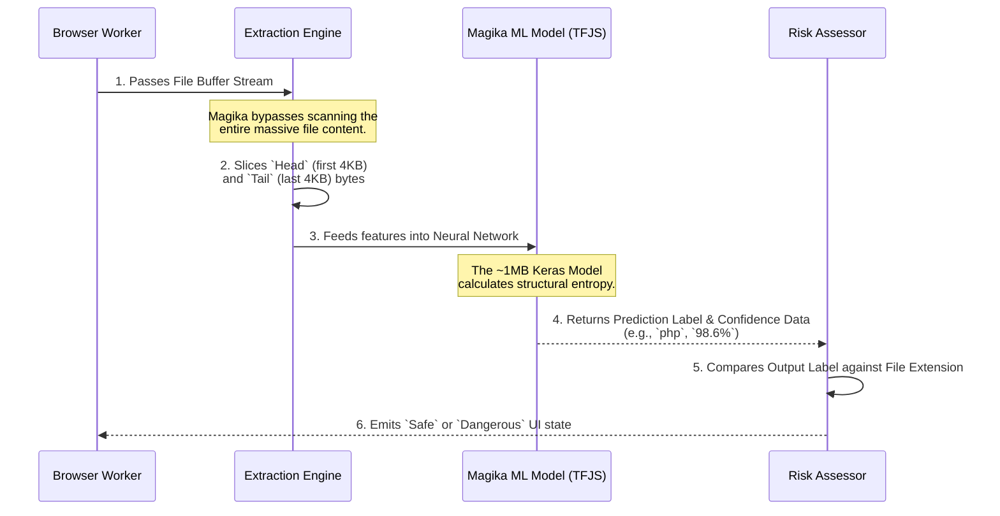

# Magika AI: Architecture & Pipeline

This document details the underlying mechanics of **Google Magika**, the deep-learning engine powering the local inference capabilities of the Magika Chrome Extension. 

By replacing classical heuristic-based signature scanning with a machine-learning approach, Magika fundamentally upgrades how file types are identified on the modern web.

---

## 🧠 Why Magika? (Size & Efficiency)

Historically, file identification relied on tools like `libmagic`, which use handcrafted regex-like rules to look for specific "magic bytes" at exact hardware offsets. Hackers easily defeat this by adding null-bytes or shifting data headers.

**The Magika Advantage:**
* **Ultra-Lightweight (~1MB Model):** The entire trained Keras Neural Network is roughly 1MB. This micro-footprint means it can be loaded entirely into browser memory without bloat.
* **Blazing Fast (Millisecond Inference):** Because the model is heavily optimized, inference executes in under 10 milliseconds per file on average CPU hardware.
* **Resilient to Evasion:** It does not rely on strict byte offsets. Because the neural network analyzes the complex entropy and structural patterns of the byte arrays, it easily detects obfuscated scripts or payloads disguised inside other file properties.

---

## ⚙️ The Inference Pipeline

The process executed by Magika is specifically optimized for memory safety. It prevents vast files (like a 4GB movie) from locking up system RAM by intelligently sampling only structural boundaries.

### Inference Workflow Diagram

### Pipeline Breakdown

1. **Targeting:** A file is passed to the Magika binding.
2. **Feature Extraction:** Rather than reading a 10GB file byte-by-byte into memory—which would crash the browser—Magika intelligently slices only the highly-structured leading bytes (the "head") and trailing bytes (the "tail"). These segments statistically contain 99% of formatting identity data.
3. **Neural Execution:** The raw byte arrays are passed into the loaded TensorFlow/Keras model as multi-dimensional tensors. The layers calculate structural entropy and syntactic tokens.
4. **Probability Output:** The model outputs an array of probabilities across 100+ native file classes (e.g., `jpeg`, `elf`, `python`, `pebin`).
5. **Verdict:** The highest probability prediction and its associated confidence score are returned for logic evaluation.

---

## 🔐 Open Source Synergy

Incorporating the [google/magika](https://github.com/google/magika) repository directly via `@google/magika` node bindings allows our extension to run locally offline. It represents a paradigm shift where enterprise-grade AI threat detection can be decentralized and run privately right on the edge (the user's browser) with zero telemetry.
