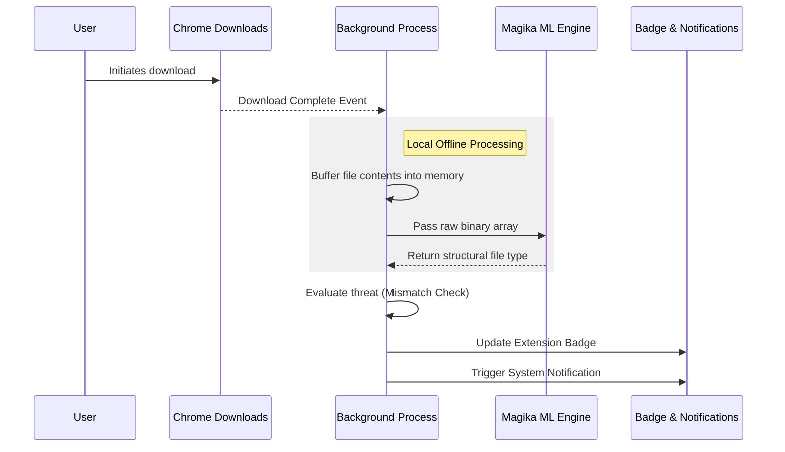

<div align="center">
  <h1>Magika File Scanner</h1>
  <p><strong>A privacy-first Chrome Extension for real-time file type detection and malware mimicry prevention.</strong></p>

  [](LICENSE)
  [](https://developer.chrome.com/docs/extensions/mv3/)
  [](https://google.github.io/magika/)
</div>

<br />

---

## Overview

The Magika File Scanner is a browser extension that intercepts downloads the moment they complete on your machine. It evaluates their atomic file type offline, ensuring that no user data or files ever leave your machine. 

This project leverages Google's Magika, an advanced file type detection tool, to identify obfuscated files and mitigate mimicry attacks. A mimicry attack occurs when an active threat (such as an executable or shell script) attempts to disguise itself under a benign extension (such as a standard image or document).

<br />

## Key Features

* **Offline Processing:** All processing occurs locally within your browser. The contents of your files are never uploaded or transmitted to external servers.
* **Instant Notifications:** The extension triggers system-level notifications immediately upon completing a scan. You will instantly know if a file is safe or dangerous.
* **Mimicry Prevention:** Automatically correlates the underlying structure of the file against its file extension.
* **Clear Interfaces:** User-facing notifications have been streamlined. Instead of exposing raw AI confidence scores to non-technical users, simple messages clearly identify if a file is safe or compromised.
* **Non-blocking Architecture:** System downloads proceed uninterrupted. The files are evaluated asynchronously strictly after completion to prevent transfer bottlenecks.

<br />

## System Architecture

The following diagram illustrates the offline processing workflow executed by the extension.



The architecture heavily relies on a decoupling between the Service Worker and the User Interface.

1. **Model Loader:** The extension initializes the inference graph asynchronously during startup.
2. **Local Bridge:** Once a download completes, the background script accesses the local system paths and bridges the data into memory.
3. **Inference Execution:** The local neural network analyzes the file structure, completely bypassing simple operating system headers or extensions.
4. **Threat Assessment:** A streamlined state tracker maps simple security profiles (Safe, Suspicious, or Dangerous) based on divergence between the extension and the contents.

<br />

## Installation

Because this extension requires local file access definitions, it must be loaded using Developer Mode.

### 1. Build the Extension
Ensure you have Node installed on your system.

```bash
git clone https://github.com/your-username/magika-chrome-extension.git
cd magika-chrome-extension
npm install
npm run build
```

### 2. Import into Chrome
1. Navigate to `chrome://extensions/` in your browser.
2. Enable **Developer mode** in the top right corner.
3. Click **Load unpacked** and select the `/dist` directory from your cloned project.

### 3. Grant File Access 
This step is mandatory for the extension to evaluate local files.
1. Locate the imported extension on your extensions page.
2. Click **Details**.
3. Scroll down and enable **Allow access to file URLs**.

<br />

## Acknowledgements

Developing this project locally would not be possible without the profound foundational work from the following entities:

* **Google Magika Formats Team:** For innovating AI-based file identification and open-sourcing the Keras models and JavaScript bindings that power this extension.
* **TensorFlow.js Community:** For optimizing the TensorFlow ecosystem to accommodate high-performance workloads internally within browser environments.
* **Google Chrome Web Platform:** For their robust documentation covering asynchronous processing pipelines under Manifest V3.

<br />

## License

This project is open-sourced under the **MIT License**. 

You are free to rebuild, modify, fork, and scale this software within commercial or personal constraints. See the `LICENSE` file for the formal conditions.
